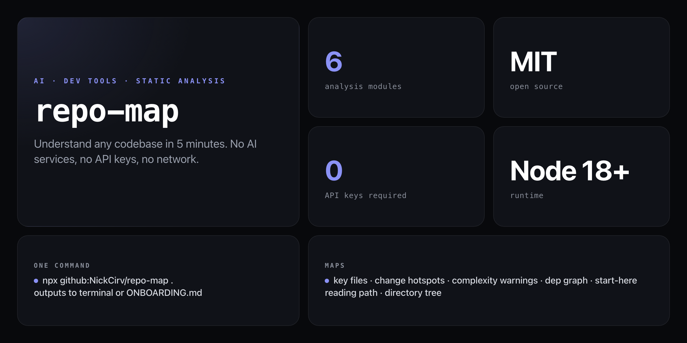

<div align="center">

**Drop into any git repo and get a ranked, structured map of the entire codebase in under a minute.**


</div>

---

You join a new project. There are 500 files. Nobody wrote docs. Where do you even start?

`repo-map` runs pure static analysis + git log parsing — no network, no account, no AI service — and produces a ranked guide: the key files to read first, the hottest change zones, the complexity warnings, and a straight-line start-here path.

```
  REPO-MAP  v1.0.0

  ── Quick Stats ──────────────────────────────────────
  Files: 147  │  LOC: 12,847  │  Languages: TypeScript, CSS, JSON
  Contributors: 5  │  Last commit: 2 hours ago
  Dependencies: 12 direct, 24 dev  (npm)

  ── Key Files (read these first) ─────────────────────
  1. src/index.ts            Entry point  245 LOC │ 8 imports
  2. src/api/router.ts                    189 LOC │ 12 imports
  3. src/db/schema.ts                     312 LOC │ 5 imports

  ── Hotspots (most volatile) ─────────────────────────
  ⚡ src/api/router.ts         38 changes
  ⚡ src/components/Form.tsx   29 changes

  ── Complexity Warnings ──────────────────────────────
  ⚠  src/legacy/parser.js     847 lines (consider splitting)

  ── Start Here Path ──────────────────────────────────
  1 → README.md  2 → src/index.ts  3 → src/api/router.ts

  ✓ Report saved to ONBOARDING.md
```

## Install

No npm account needed — runs straight from GitHub:

```bash
npx github:NickCirv/repo-map .
```

Or install globally:

```bash
npm install -g github:NickCirv/repo-map
repo-map .
```

## Usage

```bash
# Map current directory, print to terminal
npx github:NickCirv/repo-map .

# Map any repo
npx github:NickCirv/repo-map /path/to/repo

# Limit directory tree depth (default: 4)
npx github:NickCirv/repo-map . --depth 3

# Save as a markdown onboarding doc
npx github:NickCirv/repo-map . --output ONBOARDING.md

# Output raw JSON (pipe to other tools)
npx github:NickCirv/repo-map . --json
```

| Flag | Description |
|------|-------------|
| `[path]` | Repo to map (default: `.`) |
| `-d, --depth <N>` | Directory tree depth limit (default: 4) |
| `-f, --format <type>` | Output format: `terminal` or `md` (default: `terminal`) |
| `-o, --output <file>` | Save report to file (implies `--format md`) |
| `--json` | Output raw JSON |

## What it analyzes

### Quick Stats
Total files, total lines of code, languages detected, last commit date, contributor count, dependency counts.

### Key Files (top 10)
Ranked by composite score: LOC weight + import depth + function count. These are the files a new developer should read first to understand the system.

### Change Hotspots (top 10)
Most frequently modified files in the last 100 commits. High-churn files are flagged automatically — they're where bugs land and where reviews should focus.

### Dependency Map
Direct and dev dependencies with version ranges. Flags packages with old major versions.

### Complexity Warnings
Files over 500 lines, deeply nested directories (more than 5 levels), circular import hints.

### Start Here Path
An ordered reading list — the 5–7 files that unlock the entire codebase for a new joiner.

## Works with any language

Any git repo with source files:

| Ecosystem | Detected via |
|-----------|-------------|
| Node.js / Bun | `package.json` |
| Python | `requirements.txt`, `pyproject.toml` |
| Rust | `Cargo.toml` |
| Go | `go.mod` |
| Ruby | `Gemfile` |
| PHP | `composer.json` |
| Java / Kotlin | file extensions |

## What it is NOT

- **Not an AI tool.** Pure static analysis and `git log` parsing — deterministic, reproducible, works fully offline.
- **Not a secrets scanner or linter.** It maps structure and churn; it doesn't audit code quality or security.
- **Not a replacement for docs.** It generates a starting point. The output is meant to be edited, committed, and kept up to date as the team evolves it.

---

<div align="center">
<sub>Node 18+ · MIT · by <a href="https://github.com/NickCirv">NickCirv</a></sub>
</div>
